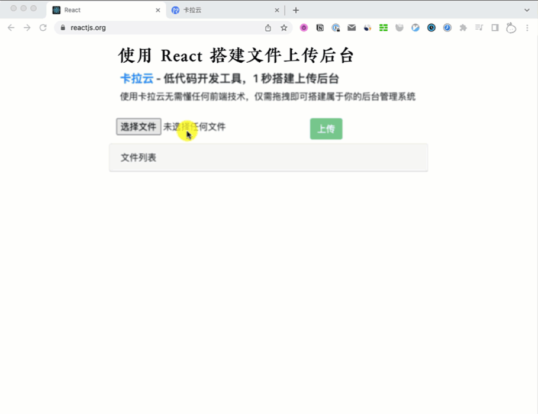

# 全栈实战教程：React + Axios + Node.js + Express 搭建「文件上传」管理后台

本教程配套文章请访问卡拉云技术博客：《[全栈实战教程：React + Axios + Node.js + Express 搭建「文件上传」管理后台](https://kalacloud.com/blog/react-axios-multiple-node-express-file-upload/)》

本教程手把手带领大家搭建一套通过 [React + Node.js + Mongodb 上传文件的后台系统](/blog/react-axios-multiple-node-express-file-upload)，只要你跟随本教程一步步走，一定能很好的理解整个前后端上传文件的代码逻辑。前端我们使用 Reactjs + Axios 来搭建前端上传文件应用，后端我们使用 Node.js + Express + Multer + Mongodb 来搭建后端上传文件处理应用。

当然，本教程还会教给大家如何写一个可以限制上传文件大小、有百分比进度条、可报错、可显示服务器上文件列表、可点击下载文件的前端操作界面。

最后完成的上传文件工具后台如下图，跟随本教学习，你也可以搭建出来。

